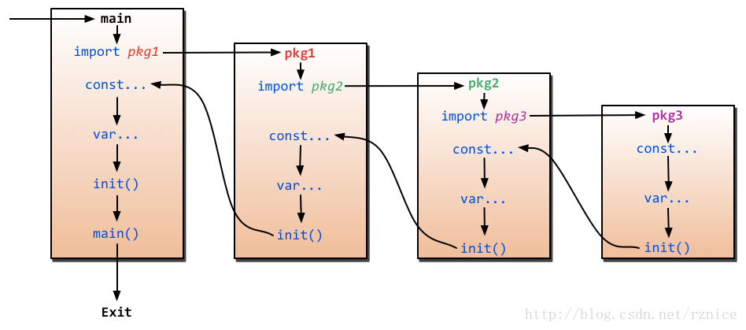

## main函数和init函数，有哪些相同之处&不同之处？执行顺序又如何？
###Go里面有两个保留的函数：init函数（能够应用于所有的package）和main函数（只能应用于package main）。
这两个函数在定义时不能有任何的参数和返回值。虽然一个package里面可以写任意多个init函数，强烈建议在一个package中每个文件只写一个init函数。

Go程序会自动调用init()和main()，所以你不需要在任何地方调用这两个函数。每个package中的init函数都是可选的，但package main就必须包含一个main函数。
程序的初始化和执行都起始于main包。如果main包还导入了其它的包，那么就会在编译时将它们依次导入。

有时一个包会被多个包同时导入，那么它只会被导入一次（例如很多包可能都会用到fmt包，但它只会被导入一次，因为没有必要导入多次）。

当一个包被导入时，如果该包还导入了其它的包，那么会先将其它包导入进来，然后再对这些包中的包级常量和变量进行初始化，接着执行init函数（如果有的话），依次类推。等所有被导入的包都加载完毕了，就会开始对main包中的包级常量和变量进行初始化，然后执行main包中的init函数（如果存在的话），最后执行main函数。

